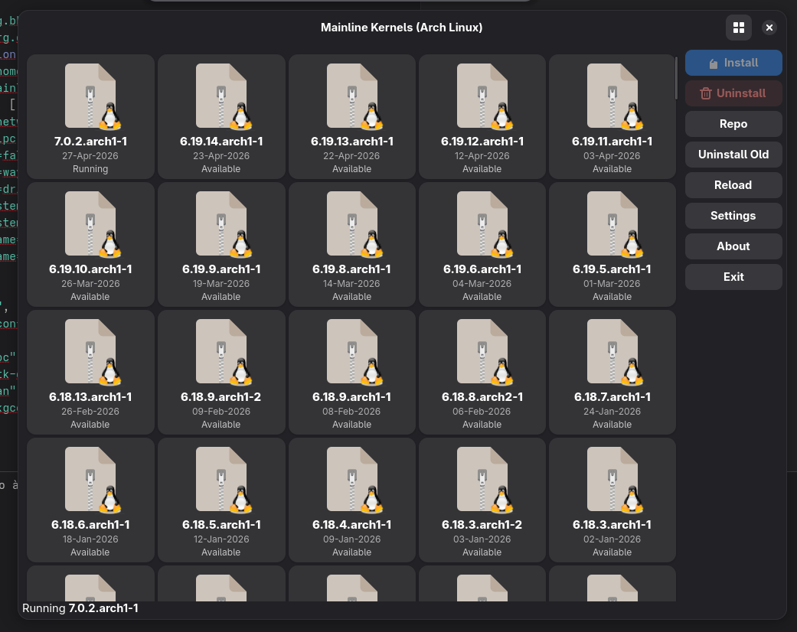
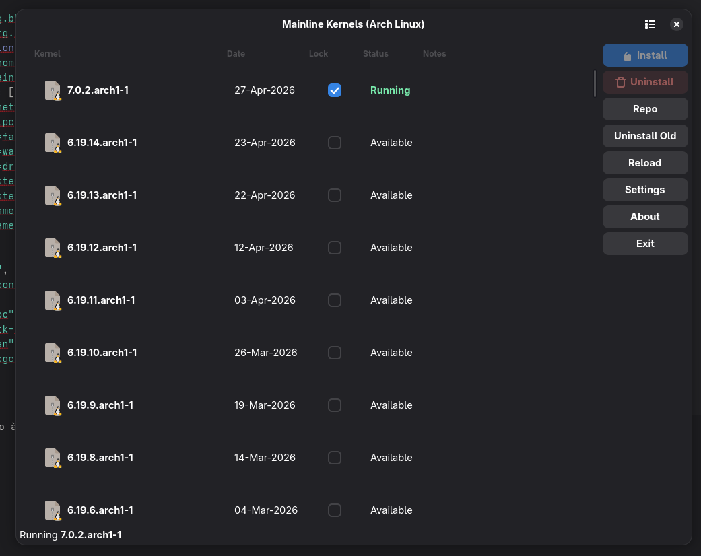
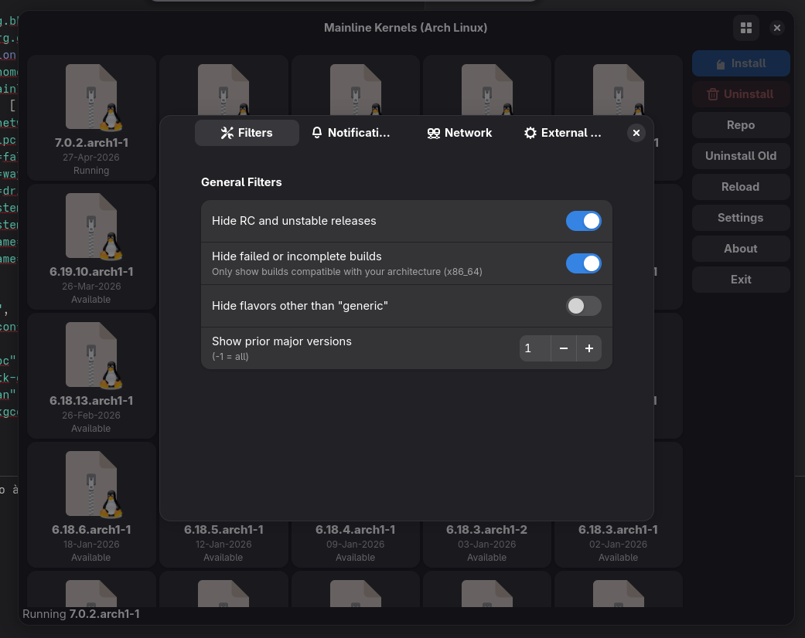
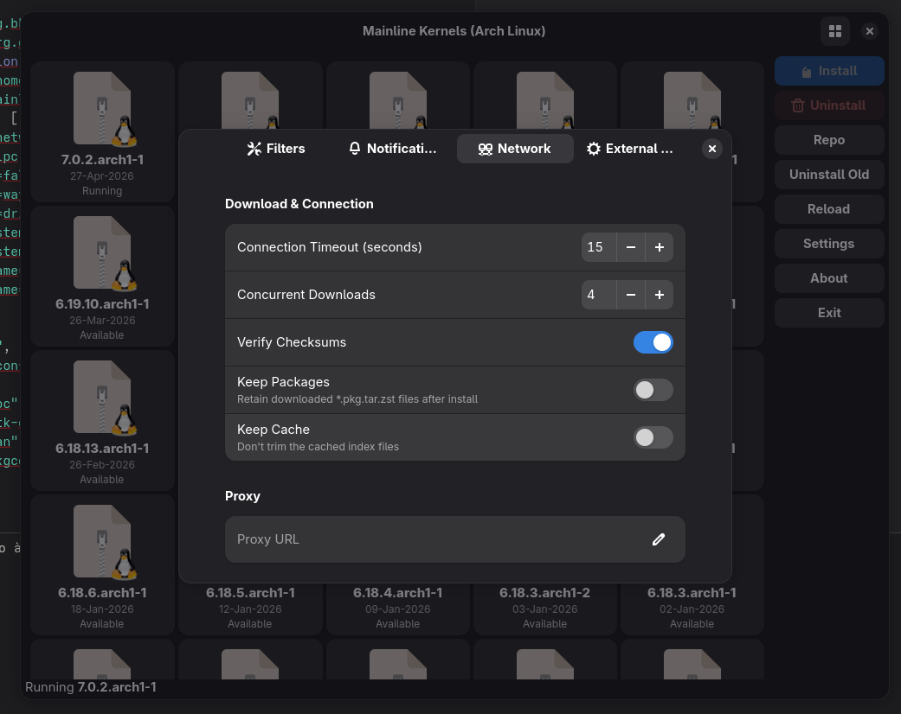
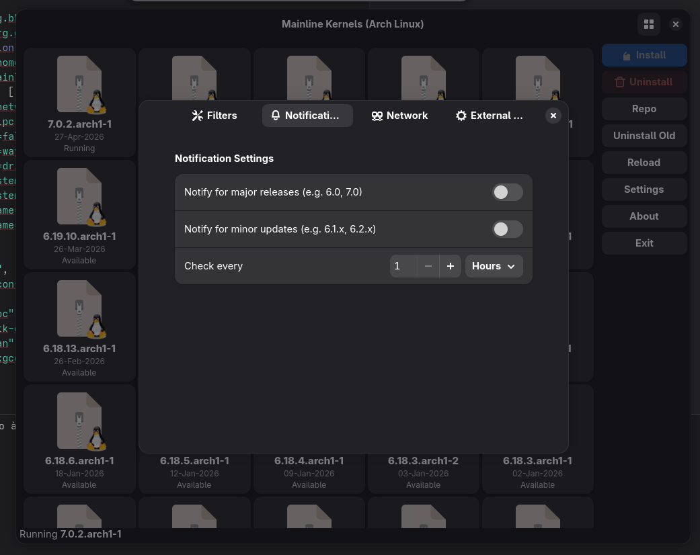
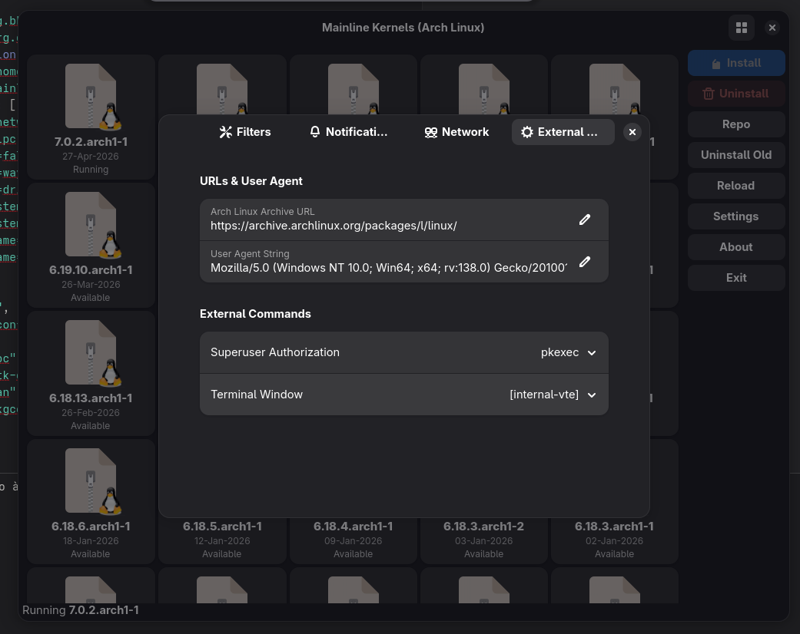

# Mainline Kernels (Arch Linux)
A tool for installing kernels from the [Arch Linux Archive](https://archive.archlinux.org/packages/l/linux/) onto Arch-based distributions.
**Current Version: 1.6.0** (The Arch Linux Edition - Stability & Precision)



## Overview
**mainline** is a modernized tool for Arch Linux users to browse, install, and manage kernel versions. This fork has been completely overhauled with **GTK4** and **Libadwaita**, offering a premium, responsive, and intuitive user experience.

## New Visual Experience
### 📱 Responsive Grid View
*   **Modern Cards**: A fresh way to browse kernels using a high-definition grid.
*   **Emblem Icons**: Each kernel card features a distinctive package icon with a sharp Tux/Arch emblem.
*   **Quick Info**: Version, release date, and status are clearly visible at a glance with refined typography.



### 📋 Polished List View
*   **Floating Rows**: Modern "card-like" list rows with rounded corners and subtle hover effects.
*   **Clean Design**: Removed cluttered grid lines for a more sophisticated, readable interface.
*   **Color-Coded Status**: "Running" kernels are highlighted in vibrant green, while "Installed" ones use accent blue.

## ⚙️ Modernized Settings
The settings window has been redesigned into a clean, modular interface using Adwaita's modern patterns:

| Filters | Notifications |
| :---: | :---: |
|  |  |
| **Network** | **External Commands** |
|  |  |

## Key Features
*   **GTK4 & Libadwaita**: Built for the modern Linux desktop with a seamless dark mode.
*   **Arch Archive Integration**: Direct access to the official Arch Linux Archive.
*   **Dual View**: Switch instantly between Grid and List views with full selection sync.
*   **Kernel Pinning**: Lock kernels to prevent accidental uninstallation.
*   **Safe Operations**: Clean, robust backend logic for kernel management on Arch.

## Evolution: From v1.4.13 to v1.6.0
This project has evolved from the original **v1.4.13** (focused on Ubuntu) to the current **v1.6.0** fully optimized for **Arch Linux**.

| Feature | Original (v1.4.13) | v1.6.0 (Arch Edition) |
| :--- | :--- | :--- |
| **Platform** | Ubuntu / Debian | **Arch Linux** |
| **Repository** | Ubuntu Mainline PPA | **Arch Linux Archive** |
| **Toolkit** | GTK3 / Legacy | **GTK4 + Libadwaita** |
| **UI Design** | Classic Table | **Modern Grid + Floating List** |
| **Package Type** | `.deb` | **`.pkg.tar.zst`** |
| **Management** | `dpkg` / `apt` | **`pacman`** |
| **Build System** | `Makefile` | **`Meson` + `Ninja`** |
| **Kernel Logic** | Standard overwriting | **Versioned side-by-side support** |
| **Initramfs** | Triggers | **Native `mkinitcpio` integration** |
| **Secure Boot** | Legacy scripts | **Modern `sbctl` guidance** |

## Features
* Download the list of available kernels from the [Arch Linux Archive](https://archive.archlinux.org/packages/l/linux/)
* Display, install, and uninstall kernels conveniently via GUI and CLI
* Modern UI built with **GTK4** and **Libadwaita**
* Optionally monitor and send desktop notifications when new kernels become available
* Kernels are installed using `pacman -U` for full system integration

## 🚀 Recent Improvements (v1.6.0)
*   **Intelligent Deduplication**: Merges duplicate kernel entries for a cleaner list and safer uninstallation.
*   **Enhanced Arch Detection**: Improved identification of installed kernels and associated packages, specifically for the Arch Linux filesystem structure.
*   **Safer Uninstallation**: Better handling of locked kernels and guidance for manual intervention when necessary.
*   **UI Consistency**: Unified "Series" (Major.Minor) grouping in both Grid and List views with full selection synchronization.
*   **Bug Fixes**: Resolved multiple crashes, UI clipping issues, and D-Bus permission errors.

## Build & Install
To build and install on Arch Linux:

```bash
# Install dependencies
sudo pacman -S base-devel vala meson ninja libgee json-glib vte3-gtk4 libadwaita aria2

# Clone and build
git clone https://github.com/johnpetersa19/mainline_arch.git
cd mainline
meson setup build --prefix=/usr
ninja -C build
sudo ninja -C build install
```

# Usage
Look for System -> Mainline Kernels in your desktop's Applications/Start menu.

Otherwise:  
CLI
```
$ mainline --help
$ mainline
```
GUI
```
$ mainline-arch
```
Note that neither of those commands invoked sudo or pkexec or other su-alike.  
The app runs as the user and uses pkexec internally just for the pacman command.

## Buttons
**\[ Install \]** - downloads and installs the selected kernel

**\[ Uninstall \]** - uninstalls the selected kernel(1)

**\[ Repo \]** - launches your default https:// handler to the web page for the selected kernel  
If no kernels are selected (when first launching the app before clicking on any) launches the main page listing all the kernels.  
Use this to see the build summary and file list.

**\[ Uninstall Old \]** - uninstalls all installed kernels below the latest installed version(1)

**\[ Reload \]** - deletes, re-downloads, and re-reads the local cached copies of the index from the Arch Archive, and regenerates the displayed list.  

**\[ Settings \]** - access the [settings](settings.md) dialog to configure various options

**\[ About \]** - basic info and credits

**\[ Exit \]** - order pizza

(1) The currently running kernel and any locked kernels are protected and ignored.

## Pinning / Locking
The Lock checkboxes serve as both whitelist and blacklist.

A locked kernel will be frozen in whatever state it was in when you locked it.  
If it was installed, it will now stay installed.  
If it was not installed, it will now stay uninstalled.

All forms of install/uninstall commands & methods are affected.  
The gui "Install" and "Uninstall" buttons are inactive on that kernel.  
The cli "--install" and "--uninstall" commands ignore that kernel.  
The gui "Uninstall Old" button and the cli "--uninstall-old" command ignore that kernel.  
The cli "--install-latest" and "--notify" for the background notification ignore that kernel.  
The kernel is still visible, you can still write notes and pull up the Archive info page and toggle the lock to unlock it.

This can be handy to keep a stock distribution kernel from being uninstalled by "Uninstall Old", or prevent a known buggy kernel from being installed by "--install-latest" and prevent "--notify" from generating a notification to install it.

## Notes
Clicking on the Notes field allows to attach arbitrary note text to a kernel.

## Display Sorting
All column headers are clickable to re-sort the list.  
The "Kernel" coulumn sorts by the special kernel version number sort where "1.2.3-rc3" is higher than "1.2.3-rc2", yet "1.2.3" is higher than "1.2.3-rc3".  
Sorting on the "Lock" column is a way to see all locked kernels together.  
Sorting on the "Status" column is a way to see all installed kernels together.  
Sorting on the "Notes" column is a way to see all kernels that have any notes together.  

# Help / FAQ

## [Arch Linux Archive](https://archive.archlinux.org/packages/l/linux/)

## General debugging  
  The `-v` or `-v #` option, or the environment variable `VERBOSE=#`, enables increasing levels of verbosity.  
  Example: `$ mainline-arch -v 3` or `$ VERBOSE=3 mainline-arch`  
  The -v option may also be used alone or repeated. The default with no `-v` is the same as `-v 1`.  
  Each additional `-v` is like adding 1. ie: `-v -v -v` is like `-v 4` or `VERBOSE=4`  
  0 = silence all output  
  1 = normal output (default)  
  2 = same as --debug  
  3 = more verbose  
  4 = even more  
  5+ mostly just for uncommenting things in the code and recompiling, not really useful in the release builds
  
  A few lines of output are printed before the commandline has been parsed, so `-v 0` doesn't silence them.  
  The environment variable is read earlier in the process and can silence all output.  
  `VERBOSE=0 mainline install-latest --yes`

  The exit value is also meaningful.  
  `VERBOSE=0 ;mainline install-latest --yes && mainline uninstall-old --yes`  

## If **Uninstall Old** doesn't remove some distribution kernel packages  
  Use your normal package manager like pacman to remove the parent meta-package:  
  `$ sudo pacman -Rs linux`  
  Then **Uninstall Old** should successfully remove everything.  

## Secure Boot  
  If you want to have secure boot, then you need to have a signed kernel. Mainline kernels are not signed by default.
  On Arch Linux, you can use tools like [sbctl](https://github.com/Foxboron/sbctl) to sign your own kernels.

## Kernels with broken dependencies  
  The build environment for kernels might occasionally break compatibility with your current system.
  The best resolution is to keep your system updated:
  `$ sudo pacman -Syu`
  And don't install any newer kernels until any conflicts are resolved.

## Missing kernels  
  Only viable installable kernels are shown by default. Failed or incomplete builds for your platform/arch are not shown unless the "Hide Invalid" setting is un-selected.  
  If you think the list is missing a kernel, press the "Repo" button to jump to the Arch Linux Archive where the packages come from.

# TODO & WIP
* Replace Process.spawn_async_with_pipes("aria2c ...",...) with libcurl  
* Make the background process for notifications detect when the user logs out of the desktop session and exit itself  
* Move the notification/dbus code from the current shell script into the app and make an "applet" mode  
* Combine the gtk and cli apps into one, or, make the gtk app into a pure front-end for the cli app, either way  
* Replace the commandline parser  
* Toggles to show/hide the rc or invalid kernels in the main ui instead of going to settings  
* Right-click menu for more functions for a given kernel, such as reloading the cache just for a single kernel to check for new build status etc, without adding 18 buttons all over the ui.  

# hints  
* cron job to always have the latest kernel installed.  
  If you install this, you should disable the notifications in settings.
```
$ sudo -i
# cat >/etc/cron.d/mainline <<-%EOF
	# Check for new kernels every 4 hours, randomize over ~2.8 hours
	1 */4 * * * root sleep ${RANDOM:0:4} ;VERBOSE=0 ;mainline --install-latest --yes && { mainline --uninstall-old --yes ;for a in /home/*/.Xauthority ;do echo [[ -s $a ]] && DISPLAY=:0.0 XAUTHORITY=$a notify-send -t 0 -a mainline -i mainline "Mainline Kernels" "New kernel installed" ;done ; }
%EOF